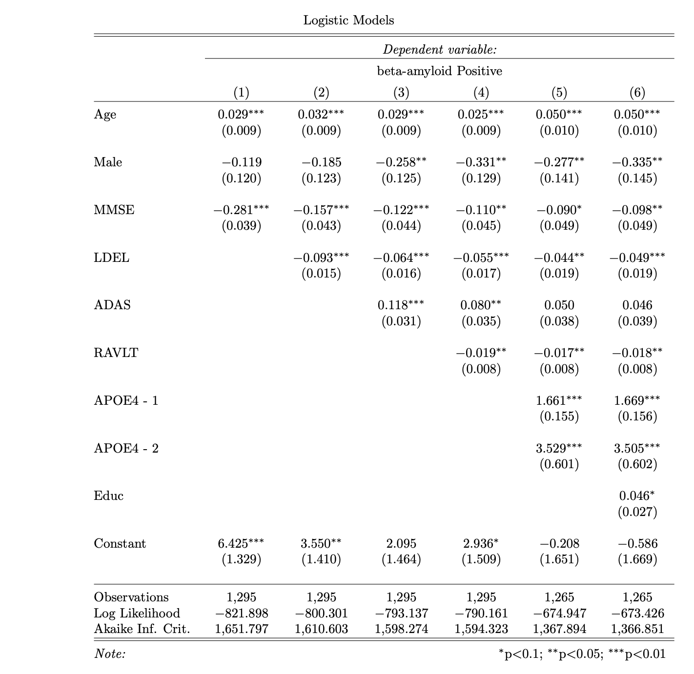
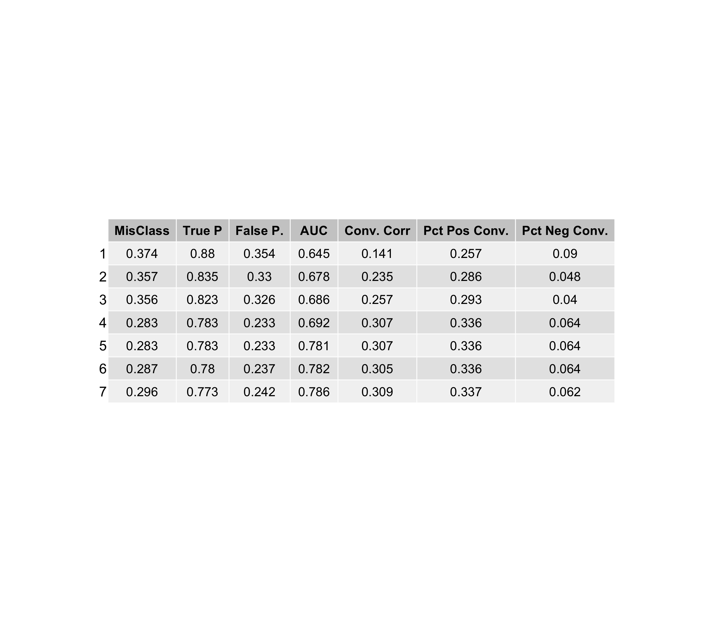
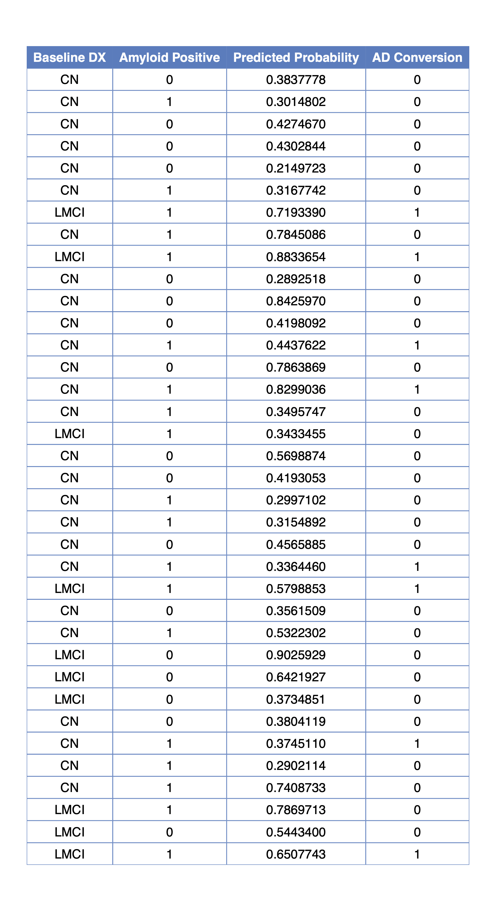
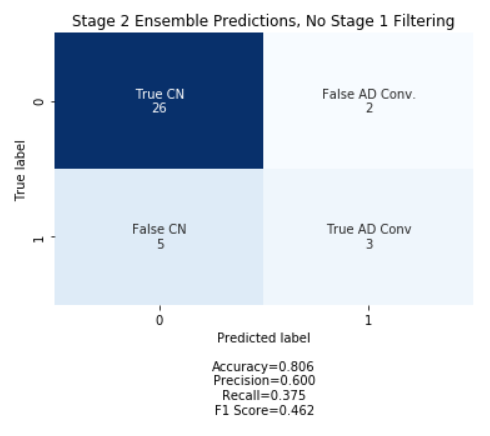
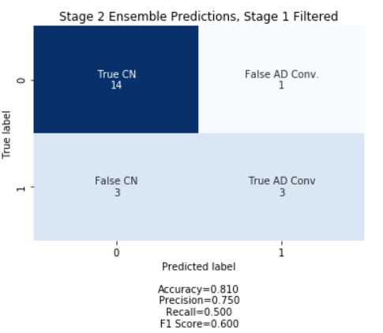

# Filtering and Classifying ADNI Participants

## Contributors:

-   [Brian Collica](https://github.com/bcollica)
-   James Koo
-   Ryan Roggenkemper
-   [Ben Searchinger](https://github.com/bsearchinger)

## TLDR

This repository contains R and Python code for reproducing our analysis of data from the Alzheimer's Disease Neuroimaging Initiative (ADNI). The model is a two-stage process whereby participants are filtered based their estimated risk for being amyloid-beta positive, and then subsequently classified as either high or low risk for future Alzheimer's Disease conversion.

While our analysis approach included many difficulties, our overall result was that filtering patients based on Alzheimer's risk factors improved performance when predicting conversion probabilities.

## Data Acquisition

All data required are available through [ADNI](https://adni.loni.usc.edu/) and the Image and Data Archive provided by the [Laboratory of Neuro Imaging](https://www.loni.usc.edu/) at the University of Southern California.

## Repository Structure

The repository has five main directories: `ADNI_data`, `processed_data`, `R`, `nitorch`, and `CNN`. The following raw data files must be downloaded from ADNI and put into `ADNI_data`:

-   `ADNIMERGE.csv`: a collection of key metrics and observations for all ADNI participants
-   `UPENNBIOMK_MASTER.csv`: cerebrospinal fluid analysis (University of Pennsylvania).
-   `UCBERKELEYAV45_01_14_21.csv`: AV45 PET analysis (University of California, Berkeley).
-   `UCBERKELEYFDG_05_28_20.csv`: FDG PET analysis (University of California, Berkeley).
-   `UCBERKELEYAV1451_01_14_21.csv`: tau PET analysis (University of California, Berkeley).
-   `ADNI_UCD_WMH_09_01_20.csv`: white matter hyperintensities (University of California, Davis).
-   `ADNI_PICSLASHS_05_05_20.csv`: medial temporal lobe measurements (University of Pennsylvania).

Additionally, image data must be downloaded and put into the appropriate place within `CNN`. Note that the image files must be `Nifti` (.nii) formatted. This is not necessarily the default file format within ADNI, however all image files can be downloaded as `Nifti` from the ADNI website. MRI image files go into the `MRI_holdout` and `MRI_training` files within the `MRI_Data` directory, and the corresponding csv file descriptions go into the `MRI_csv` directory. The same structure holds for PET scans. Only the holdout files are required for code replication, as trained models exist in the `trained_cn_ad_mri` and `trained_cn_ad_pet_2` directories.

The holdout set used for final evaluation consists of data from 36 individuals. Their individual ADNI subject IDs can be obtained by utilizing the Advanced Search (beta) functionality in the Search tab at <https://www.loni.usc.edu/>.

1.  Search for pre-processed "MPR; GradWarp; B1 Correction; N3; Scaled" MRI images for CN, AD, SCM, EMCI, and LMCI participants with of the ADNI study.  
2.  Download the 2,595 results as a `.csv`.
3.  Search for pre-processed "AV1451 Coreg, Avg, Std Img and Vox Siz, Uniform Resolution" PET images for CN, AD, SCM, EMCI, and LMCI participants with of the ADNI study.
4.  Download the 1,255 results as a `.csv`.
5.  Inner join the two files based on the Subject ID column to get observations of 36 unique participants to use as the holdout set.
6.  Save this merged file as `holdout.csv` in the `processed_data` directory.

## Code Replication

Once the data files have been placed in the `ADNI_data` and `CNN` directories, run the following scripts with the working directory set at the top level of the repo.

### Amyloid Positivity Data Processing

The R script, `R/amyloid_pos.R`, will output two `.csv` files to the `processed_data` directory: `adnim.csv` and `amyloid_pos_data.csv`. The dimensions of the files should be 15171 x 58 and 12330 x 57 respectively. `amyloid_pos_data.csv` contains new variables which describe a subject's amyloid-beta status to be used in subsequent analysis. The variables are as follows:

-   `upenn_pos_bl`: 1 if subject was amyloid-beta positive at baseline CSF measurements provided by Upenn, 0 otherwise.
-   `upenn_any_pos`: 1 if subject was amyloid-beta positive at any time period CSF measurement provided by Upenn, 0 otherwise.
-   `av45_pos_bl`: 1 if subject was amyloid-beta positive at baseline AV45 analysis provided by UC Berkeley, 0 otherwise.
-   `first_vis_pos`: 1 if subject was amyloid-beta positive at their first visit AV45 analysis (not necessarily baseline) provided by UC Berkeley, 0 otherwise.
-   `av45_any_pos`: 1 if subject was amyloid-beta positive at any time period AV45 analysis provided by UC Berkeley, 0 otherwise.
-   `abeta_pos`: 1 if subject had a raw ABETA measurement below 977 at any time period, 0 otherwise.
-   `beta_pos_vote`: 1 if any one of `abeta_pos`, `av45_any_pos`, or `upenn_any_pos` is 1, 0 otherwise.

### MRI and PET Volume Data Processing

The R scripts, `R/MRI_volume.R` and `R/PET_volume.R`, will output three `.csv` files to the `processed_data` directory: `master_mri_volume.csv`, `master_pet_volume.csv`, and `master_pet_suvr.csv`. The dimensions of the files should be 1127 x 47, 1108 x 127, and 1108 x 127 respectively.

### Stage 1 - Modeling Amyloid Positivity

The R script, `R/amyloid_model_analysis.R`, performs 5-fold cross-validation for seven different candidate models of amyloid-beta positivity as a function of baseline measurements. The binary response variable is `beta_pos_vote` as described above. All candidate models are variations of logistic regression with different classes of predictors. In general, the models start out by containing variables collected from minimally invasive sources, such as cognitive assessment tests, and subsequently add predictors loosely based on the level of invasiveness to the subject required to obtain the information.

For example, the predictors for model 1 include age, sex, and the subject's baseline score on the Mini Mental State Examination (MMSE_bl). Model 2 includes age, sex, MMSE, and the subject's baseline delayed recall score on the Logical Memory test (LDELTOTAL_bl), and so on. Models 1 - 4 do not contain any genetic markers, but models 5 - 7 include genetic results for the presence of Apolipoprotein E on either one (APOE_1) or two (APOE_2) alleles. The regression table below displays results for models 1 - 6 using observations from baseline visits of the full training data.

The script will output two `.csv` files to the `processed_data` directory: `amyloid_cv_table.csv` and `amyloid_sample_table.csv`. The first contains the cross-validated estimates of the various performance metrics, and the second contain summary statistics regarding the relationship between amyloid-beta positivity and Alzheimer's Disease conversion rates in the sample of individuals considered in this analysis.

PDFs and PNGs of these tables are also created and saved in the `figures` directory.

### Stage 1 - Predicting Amyloid Positivity

The R script, `R/stage1.R`, predicts amyloid-beta status for the 36 individuals included in the holdout set and outputs the results into `stage1_table.csv` in the `processed_data` directory, along with figures in the `figures` directory.

### Stage 2 - Modeling Alzheimer's Disease Conversion Probabilities

The iPython notebooks `MRI_Ensemble` and `PET_Ensemble` each use a 9 layer 2D CNN to classify patients in the training set as either cognitively normal (CN) or Alzheimer's disease (AD). They consider MRI and tau PET scans separately, to later ensemble together.

Each model uses 10 coronal central brain slices to ultimately classify patients as CN or AD. This means there are 10 models for each modality each corresponding to a specific slice. These slices are preconfigured, and whole brain scan Nifti files should be placed into the correct directories without modifications.

A validation split of 10% of the training dataset is automatically computed. Then, for each slice, models are trained using 5 fold cross-validation. The fold with the highest validation accuracy is retained and saved into the corresponding directory, noted above.

If only replication is desired, then it's not advisable to retrain all models as the process is time consuming. However, the code is all designed to be parallelized, so access to a computing cluster significantly increases computation speed. Whether or not the models are retrained, the script then serially loads in each model for holdout prediction. Each of the $n$ image files in the holdout set are then run through each model, yielding $n$ softmax regression probabilities of patients belonging in the AD group. This is repeated 10 times, once for each slice, yielding a $n$ x 10 matrix of predictions. This is distilled into a boolean $n$ x 1 vector using the rule average(P(1)) \>= .4, that is average of all softmax probabilities of AD across all 10 slices greater than 40%.

The $n$ image files are actually comprised of multiple observations of $m$ \< $n$ patients. This approach maximizes the amount of information available for each patient, but the number of scans per patient are not consistent between patients. The $n$ x 1 boolean vector is then compressed into an $m$ x 1 numeric vector by simply averaging the prediction labels for each patient. These results are then saved in the `processed_data` directory by default.

Note that the steps laid out above are for a single modality, that is either PET or MRI. While these steps are the same, they must be run twice--once for each modality.

Also note that `nitorch` is a custom package that only appears to exist in [this Github repository](https://github.com/moboehle/Pytorch-LRP/tree/master/nitorch). We do not recommend trying to modify these files or install any other packages called `nitorch`.

### Stage 2 - Alzheimer's Disease Conversion Ensemble Predictions

There should now be two additional csv files within the `processed_data` directory, one with MRI predictions and one with PET predictions. There should also be a file named `final_preds.csv` within the directory, which gives the true AD conversion labels as well as the Stage 1 model prediction labels. The default ensemble predictions are also contained in `final_preds.csv`, but they can be recalculated using the rule MRI_prediction + PET_prediction \>= 1 if desired. This gives equal weighting to both modalities, and guarantees that consistent positive predictions for a single modality will guarantee a positive prediction for the ensemble.

The iPython notebook `Analysis.ipynb` within the `CNN` directory assess the accuracy metrics of the ensemble Stage 2 model. If the ensemble predictions were recalculated, then the recalculated values should replace the default values in the `MRI_PET_Ensemble` column of `final_preds.csv`. The script then generates the confusion matrices shown below, and saves them in the `figures` directory.

### Stage 2 - Alternate Predictions via Logistic Ridge Regression

As an alternative to the neural network ensemble, we also propose using a penalized logistic regression on brain volumetric measurements provided by labs at UPENN and UC Berkeley. The measurements come from MRI and tau PET scans. (add more here)

The R script, `R/volumetric_analysis.R`, combines volume measurements from MRI scans separately with volume and SUVR measurements from tau PET scans. The data are then split into training and validation sets leaving out the holdout patients entirely. A custom labeling scheme is implemented to code patients as either AD or not which replicates the type of individuals in the holdout set and also what one might normally encounter in a clinical setting.

The script outputs two training sets (`training_set_volume.csv` and `training_set_suvr.csv`) and two validation sets (`validation_set_volume.csv` and `validation_set_suvr.csv`) to the `processed_data` directory. Figures of the AUC tables for all models are also output, as well as a `.csv` containing the values. The model with the best cross-validated performance tends to use the MRI volume + PET SUVR data with alpha = 0. The corresponding penalty is approximately 0.0518844.

The training and validation sets are combined into a final file titled `final_set0.0518844239876985.csv` which houses the full penalty value and is written to the `processed_data` directory. This file is then read into `R/stage2.R` script which fits the model on the combined data and predicts the results for individuals in the holdout set who received these scans. Those predictions are written to `processed_data/volume_holdout_preds.csv`.
